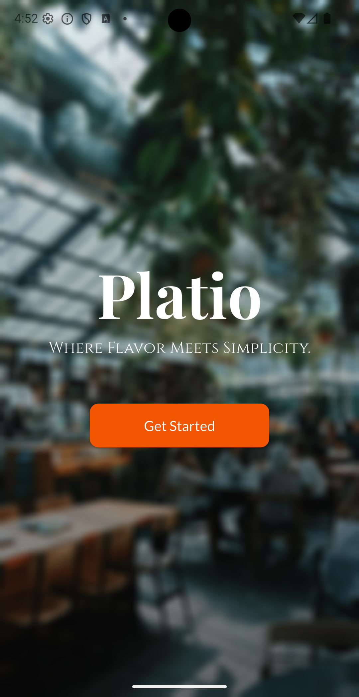
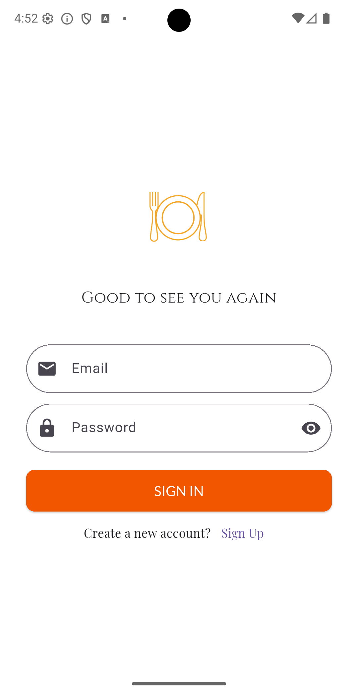
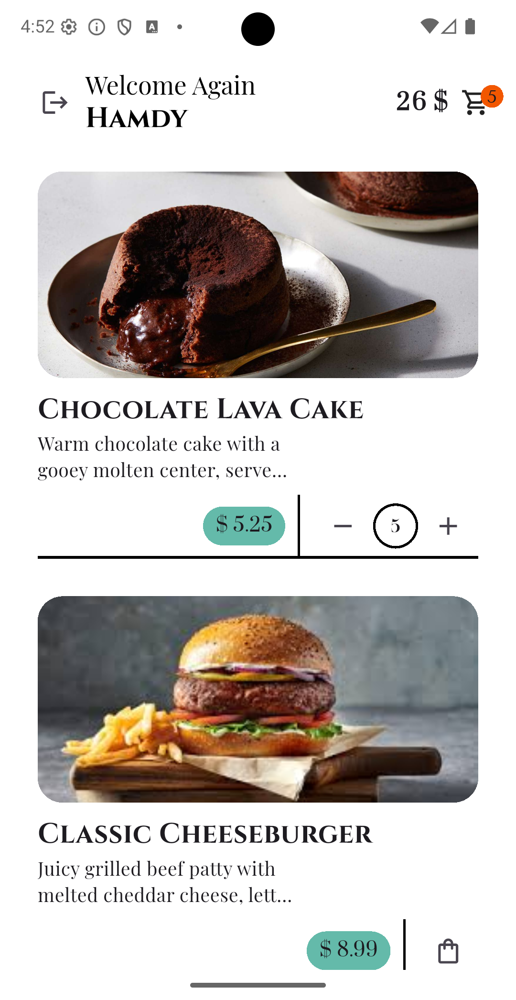
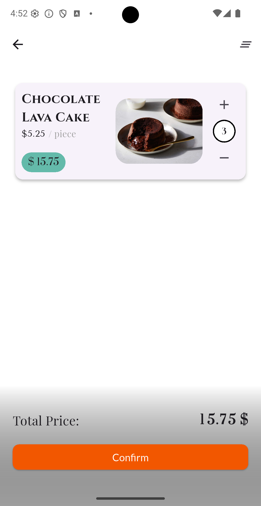

# Platio  

**Platio** is a modern and modular Flutter restaurant app designed with a clean UI, smooth animations, and a seamless user experience.  

It allows users to:  
- Browse a list of menu items
- View details and prices of each meal
- Adjust item quantities dynamically
- Interact with Firebase for authentication and Firestore data  

The app follows the **MVC (Model-View-Controller)** architectural pattern for better scalability and maintainability.  

---

## Architecture  

Platio is built using the **MVC** pattern for scalability and clarity:  

- **Model**  
  - Defines the `menuItem_Model` class for representing menu items, including title, description, price, and image URL.  

- **View**  
  - Contains **screens** like Splash, Login, Start, and ListScreen for displaying content.  
  - Includes reusable **widgets** like `CartItem`, `Counter`, and `CustomAppBar` for modular UI composition.  

- **Controller**  
  - Manages **state** using **Riverpod**, controlling item counters.

- **Service**    
  - Handles Firebase initialization and business logic.  

---

## Features  

### Splash & Welcome Screens  
- **Native splash screen** for seamless startup.  
- **Welcome Screen with animated logo (Lottie animation)** to create a smooth onboarding experience before login.  

### Login Screen  
- Secure **Firebase Authentication** (email & password).  
- Displays user info (name) after successful login.  

### Menu List Screen  
- Fetches a **dynamic list of menu items** from Firebase.  
- Includes a **counter widget** to let users increase/decrease item quantity smoothly.
- Shows **Cart items** with prices.

### Cart & Counter Widgets  
- **CartItem widget** shows a menu item inside the cart UI.  
- **Counter widget** the same as before: lets users increase/decrease item quantity smoothly.

### Firebase Integration  
- **Firebase Core** for app setup.  
- **Future support for Firestore** to dynamically load menu data.  

---

## Tech Stack & Packages  

```yaml

  # Splash & Animations
  flutter_native_splash: ^2.4.6
  lottie: ^3.3.1

  # UI & Badges
  badges: ^3.1.2
  animated_flip_counter: ^0.3.4
  google_fonts: ^6.2.1

  # Firebase Integration
  firebase_auth: ^5.7.0
  cloud_firestore: ^5.6.12

  # State Management
  flutter_riverpod: ^2.6.1

```

---

## Project Structure  

```bash
lib/
 ├── main.dart                  # App entry point
 ├── Controller/               # Business logic & state
 │    └── stateManagement.dart
 ├── Model/                    # Data models
 │    └── menuItem.dart
 ├── View/
 │    ├── Screen/              # Main app screens
 │    │    ├── splashScreen.dart
 │    │    ├── loginScreen.dart
 │    │    ├── startScreen.dart
 │    │    └── listScreen.dart
 │    └── Widget/              # Reusable UI components
 │         ├── cart_item.dart
 │         ├── counter.dart
 │         ├── customAppBar.dart
 │         └── menu_item.dart
 └── Service/
      └── firebase.dart       # Global constants & config
```

---

## Installation  

1. **Clone the repository:**  
   ```sh
   git clone https://github.com/AbdelrahmanHamdyDev/platio.git
   cd platio
   ```

2. **Install dependencies:**  
   ```sh
   flutter pub get
   ```

3. **Configure Firebase:**  
   - Follow [Firebase Setup Guide](https://firebase.google.com/docs/flutter/setup).   

4. **Run the app:**  
   ```sh
   flutter run
   ```

---

## App Screens  

| Welcome Screen                         | Login Screen                         | Menu Screen                         | Cart Screen                               |
| ------------------------------------- | ------------------------------------ | ---------------------------------------- | ----------------------------------------- |
|      |       |        |              |

---

## 🤝 Contributions  

Contributions, issues, and feature requests are welcome!  
Feel free to fork the repo and submit a pull request.
